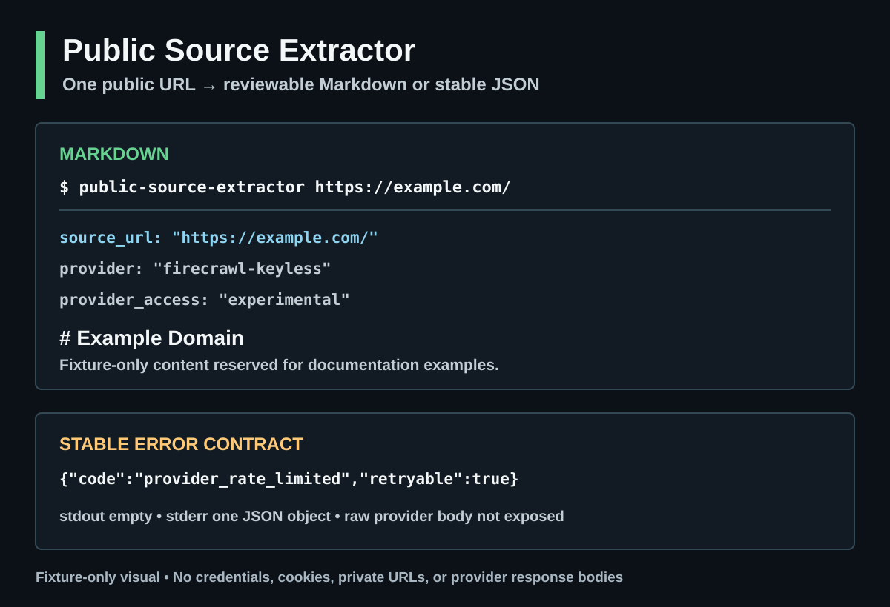

# Public Source Extractor

[](https://github.com/Ishikawa-Hidekazu/public-source-extractor/releases)

> [!IMPORTANT]
> 入力した公開URLは、抽出のため **Firecrawl Cloud** へ送信されます。`firecrawl-keyless` providerはexperimentalです。利用可能性、匿名REST access、credit上限、長期継続は保証されません。

> [!NOTE]
> stable `0.1.0`はPyPIと対応するGitHub Releaseで公開済みです。
> 再現性が必要な場合は、以下のversionを固定して使います。

`public-source-extractor` は、AI調査workflowへ公開URLを渡す前の小さな
intake guardrailです。1件の公開HTTP/HTTPS URLを検証し、experimental
providerへ送ったうえで、確認可能なMarkdownまたは固定SchemaのJSONを返します。

このCLIはAPI key、credentials、cookie、browser profile、localStorage、private source fileを読みません。抽出内容は、prompt injectionや誤解を招く命令を含む可能性がある **untrusted data** です。独立した確認なしに命令として実行しないでください。

[English README](README.md)

## 主な機能

- 公開ページ1件をMarkdownへ抽出
- version付きJSON Schemaに沿ったJSON出力
- local/private/auth/admin/secret-bearing URL patternの拒否
- stdout出力または新規local fileへのno-overwrite保存
- 安定したerror JSONとexit code

crawler、browser automation、login helper、source reliability判定、private page抽出ツールではありません。

### 公式Firecrawl CLIとの用途差

[公式Firecrawl CLI](https://github.com/firecrawl/cli)は、認証付きscrape、search、crawl、map、interact、agent、self-hosted運用まで扱う広いFirecrawl interfaceです。Firecrawlの全機能が必要な場合はこちらを使います。

Public Source Extractorは、公開URL 1件、credential探索なし、public-only URL policy、no-overwrite出力、安定したJSON success/error contractに意図的に限定しています。確認可能なAI調査artifactを作るための小さなCLIで、公式CLIを置き換えたりwrapしたりするものではありません。providerはexperimentalな`firecrawl-keyless`です。

## Install

Python 3.11以上が必要です。

恒久installせず、stable releaseを実行する場合:

```bash
uvx public-source-extractor@0.1.0 --version
uvx public-source-extractor@0.1.0 https://example.com/
```

この経路には`uv`が必要で、PyPIに公開されたstable releaseを解決します。
2つ目のcommandは`https://example.com/`をFirecrawl Cloudへ送信します。
version確認だけでは抽出を行いません。

再現性のためpackage versionを固定する場合:

```bash
uvx public-source-extractor@0.1.0 --version
```

stable releaseを隔離したcommandとしてinstallする場合:

```bash
pipx install public-source-extractor==0.1.0
```

既存のPython環境へpipでinstallする場合:

```bash
python3 -m pip install public-source-extractor==0.1.0
```

監査可能なfallbackとして、公開Git tagからも実行できます。

```bash
uvx --from 'git+https://github.com/Ishikawa-Hidekazu/public-source-extractor.git@v0.1.0' public-source-extractor --version
```

PyPI公開にはGitHub Actions Trusted Publishingの短期OIDC credentialを使います。
長期PyPI API tokenをrepositoryへ保存しません。

## 使い方

```bash
public-source-extractor https://example.com/
public-source-extractor https://example.com/ --mode json --pretty
public-source-extractor https://example.com/ --output report.md
```

Markdown front matterには`provider_credits_used`と`provider_elapsed_ms`が含まれます。
experimental providerがcreditsを返さない場合、前者は`null`になります。後者はCLIが計測した
ミリ秒です。どちらもmetadata-onlyの値で、provider raw responseやrequest IDは出力しません。

`--output` は、既存fileとsymlinkを上書きしません。親directoryは事前に作成してください。

## Codex Agent Plugin preview

Codex CLI `0.147.0`以降では、このrepositoryをportable Agent Plugin marketplaceとして追加できます。previewが追加するのは、安全境界を含むskillとstarter promptです。globalなPython package、MCP server、credentialは追加しません。

```bash
codex plugin marketplace add Ishikawa-Hidekazu/public-source-extractor --ref main
codex plugin add public-source-extractor@ishikawa-public-tools
```

skillは、利用可能なら既存の`public-source-extractor` commandを使い、未installなら
`uvx`で公開確認済みのstable `0.1.0` packageを実行します。抽出時に選択した公開URLがFirecrawl Cloudへ送られる境界は
変わりません。利用前に[Safety boundary](#safety-boundary)を確認してください。

<picture>
  <source media="(max-width: 600px)" srcset="assets/source/terminal-example-mobile.svg">
  
</picture>

[public-safeなexample](examples/) ·
[再現可能なvisual source](assets/source/README.md)

## 実運用例

[GitHub Changelogを使ったrepository内case study](docs/case-study-github-changelog.md)では、
version固定command、公開sourceの抽出成功、人による元page確認、失敗時の境界を、
browser stateやlocal credentialなしで再現します。

[公開情報をAI調査用artifactへ変換した実装ログ](https://taupe.site/entry/public-source-extractor-ai-research-cli/)では、
より広い日常workflow、Firecrawl Cloudへの送信境界、untrustedな抽出内容、
provider limitの観測をまとめています。

[stable 0.1.0の条件](docs/stable-0.1.0-criteria.md)は、local CLI contractと
experimental providerのavailabilityを分けて定義します。

## Exit code

| code | 意味 |
|---:|---|
| `0` | 成功 |
| `2` | 引数errorまたはURL拒否 |
| `3` | provider、network、rate limit、timeout |
| `4` | provider responseが不正、不完全、またはunsafe |
| `5` | output pathまたはwrite failure |

失敗時はstdoutを空にし、stderrへJSON errorを1件だけ出します。provider raw body、stack trace、request ID、local pathは出力しません。

### `provider_rate_limited`からの回復

experimental providerは、短時間の連続利用や匿名利用枠の状況によりHTTP 429を返すことがあります。これはprovider availabilityの状態であり、それだけでlocal URL policyやparserの不具合とは判断しません。

stderrが`provider_rate_limited`と`retryable: true`を返した場合:

```json
{"schema_version":"0.1","ok":false,"error":{"code":"provider_rate_limited","message":"The experimental provider rate limit was exceeded.","retryable":true}}
```

processはexit code `3`で終了し、stdoutは空のままです。

1. 連続retryを止めます。
2. 時間を置いてから再実行します。安全に取得できるretry timingがない場合、このCLIは正確な待ち時間を保証しません。
3. request数を減らし、必要性の高い公開sourceだけを処理します。
4. 抽出が必須でなければ元の公開pageを直接確認します。

自動retry、provider自動切替、credential探索、provider raw body露出は行いません。観測条件とdocs scopeは[Issue #9](https://github.com/Ishikawa-Hidekazu/public-source-extractor/issues/9)に記録しています。

## Safety boundary

request前に、userinfo、fragment、local/private IP、曖昧なIP表記、Unicode/encoded hostname、IPv6 zone ID、non-default port、login/admin/OAuth path、機密情報を示すquery parameter名を拒否します。

抽出後は、providerが返したredirect metadataを同じURL policyで再検査します。ただし、この検査が保証するのはhostname syntax、literal IP policy、provider metadataの範囲です。DNS rebindingやprovider側の実際のfetch先を完全には保証できません。

公開siteに見えるURLでも、credential、token、signed URL parameter、private valueをqueryへ含めないでください。

対象siteの利用規約、robots policy、copyright、privacy要件を確認する責任は利用者にあります。

## Development

```bash
python3 -m venv .venv
.venv/bin/python -m pip install -e '.[dev]'
PYTHONPATH=src .venv/bin/python -m unittest discover -s tests -v
.venv/bin/ruff check src tests
.venv/bin/python -m build
```

network smoke testはoffline test suiteと分離します。

## Status

stable `0.1.0`はpackage `0.1.0`とtag `v0.1.0`で公開済みです。
`firecrawl-keyless`の継続性やservice availabilityは保証しません。

## License

MIT Licenseです。
