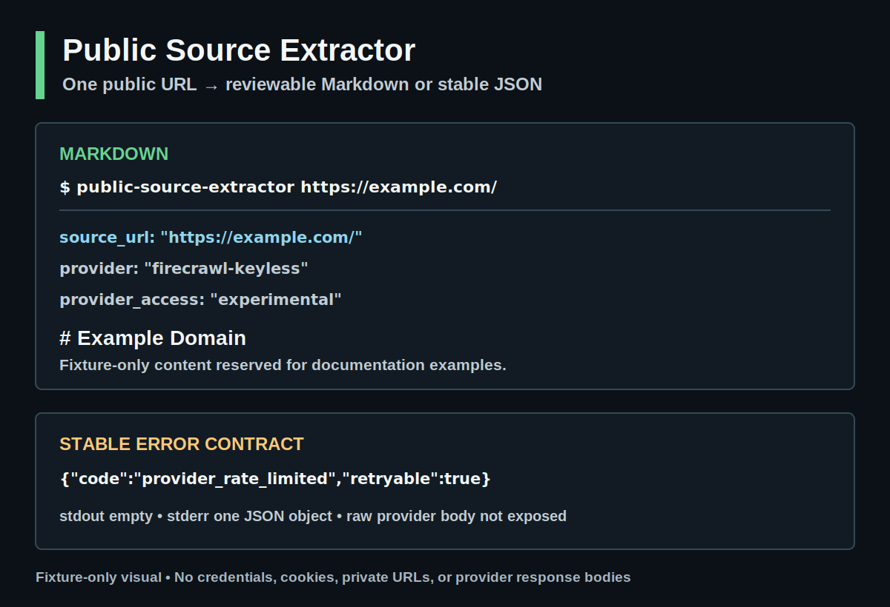

# Public Source Extractor

[](https://github.com/Ishikawa-Hidekazu/public-source-extractor/actions/workflows/ci.yml)
[](https://github.com/Ishikawa-Hidekazu/public-source-extractor/releases)


> [!IMPORTANT]
> The requested public URL is sent to **Firecrawl Cloud** for extraction. The `firecrawl-keyless` provider is experimental: availability, anonymous REST access, credit limits, and long-term continuity are not guaranteed.

`public-source-extractor` converts one public HTTP or HTTPS page into reusable Markdown or a stable JSON envelope.

The CLI does **not** read API keys, credentials, cookies, browser profiles, localStorage, or private source files. Extracted content is **untrusted data** and may contain prompt injection or misleading instructions. Do not execute or follow instructions from extracted content without independent review.

[日本語README](README.ja.md)

## What it does

- Extracts one public page as Markdown.
- Produces structured JSON with a versioned JSON Schema.
- Rejects local, private, authenticated, admin, and secret-bearing URL patterns.
- Keeps results on stdout or writes a new local file with no-overwrite behavior.
- Returns stable JSON errors and documented exit codes.

It is not a crawler, browser automation tool, login helper, source-reliability judge, or private-page extractor.

### How this differs from the official Firecrawl CLI

The [official Firecrawl CLI](https://github.com/firecrawl/cli) is the broader Firecrawl interface for authenticated scrape, search, crawl, map, interact, agent, and self-hosted workflows. Use it when you need Firecrawl's full product surface.

Public Source Extractor is intentionally narrower: one public URL, no credential discovery, a public-only URL policy, no-overwrite output, and a stable JSON success/error contract designed for reviewable AI research artifacts. It uses the experimental `firecrawl-keyless` provider and does not replace or wrap the official CLI.

## Install

Public Source Extractor requires Python 3.11 or newer.

From a checked-out source tree:

```bash
python3 -m pip install .
```

For an isolated command installation:

```bash
pipx install .
```

Install the source-only alpha from its pinned tag:

```bash
pipx install 'git+https://github.com/Ishikawa-Hidekazu/public-source-extractor.git@v0.1.0-alpha.1'
```

Or use pip in an existing Python environment:

```bash
python3 -m pip install 'git+https://github.com/Ishikawa-Hidekazu/public-source-extractor.git@v0.1.0-alpha.1'
```

The initial source-only alpha is not published to PyPI.

## Quick start

Markdown to stdout:

```bash
public-source-extractor https://example.com/
```

Markdown front matter includes `provider_credits_used` and
`provider_elapsed_ms`. The credits field is `null` when the experimental
provider does not report it; elapsed time is measured by the CLI in
milliseconds. These are metadata-only values. Raw provider responses and
request identifiers are not exposed.

JSON to stdout:

```bash
public-source-extractor https://example.com/ --mode json --pretty
```

Write a new file:

```bash
public-source-extractor https://example.com/ --output report.md
```

The output path must have an existing non-symlink parent and must not already exist.

<picture>
  <source media="(max-width: 600px)" srcset="assets/source/terminal-example-mobile.svg">
  
</picture>

[View the public-safe examples](examples/) ·
[View the reproducible visual sources](assets/source/README.md)

## Real-world use

[This Japanese implementation log](https://taupe.site/entry/public-source-extractor-ai-research-cli/) shows the CLI used to turn selected public sources into reviewable Markdown and JSON artifacts. It also documents the Firecrawl Cloud boundary, untrusted extracted content, and observed provider limits.

## CLI contract

```text
public-source-extractor <url> [--mode markdown|json]
                               [--output <new-path>]
                               [--timeout 1..120]
                               [--provider firecrawl-keyless]
                               [--pretty]
```

| Exit | Meaning |
|---:|---|
| `0` | Success |
| `2` | Usage error or rejected URL |
| `3` | Provider, network, rate-limit, or timeout failure |
| `4` | Invalid, incomplete, or unsafe provider response |
| `5` | Output path or write failure |

On failure, stdout is empty and stderr contains exactly one JSON error object. Provider response bodies, stack traces, request IDs, and local paths are not exposed.

### Recovering from `provider_rate_limited`

The experimental provider can return HTTP 429 during short bursts or across an anonymous usage window. This is a provider availability condition, not by itself a failure of the local URL policy or parser.

When stderr reports `provider_rate_limited` with `retryable: true`:

```json
{"schema_version":"0.1","ok":false,"error":{"code":"provider_rate_limited","message":"The experimental provider rate limit was exceeded.","retryable":true}}
```

The process exits with code `3` and stdout remains empty.

1. Stop the current burst instead of retrying repeatedly.
2. Wait and retry later. This CLI does not promise an exact delay when no retry timing is safely exposed.
3. Reduce request volume and process only selected public sources.
4. Use the original public page directly when extraction is not required.

The CLI does not automatically retry, switch providers, discover credentials, or expose raw provider bodies. See [Issue #9](https://github.com/Ishikawa-Hidekazu/public-source-extractor/issues/9) for the observed condition and documentation scope.

## Safety boundary

Before sending a URL, the CLI rejects:

- schemes other than HTTP or HTTPS;
- URL user information and fragments;
- localhost, local suffixes, and non-global literal IP addresses;
- ambiguous integer, octal, and hexadecimal IPv4 forms;
- Unicode or percent-encoded hostnames and IPv6 zone identifiers;
- non-default ports;
- login, admin, OAuth, and callback paths, including encoded forms;
- query parameter names that indicate tokens, secrets, passwords, credentials, signatures, sessions, cookies, authorization, or keys.

After extraction, provider redirect metadata is checked with the same public URL policy. If redirect metadata is unsafe, the result is discarded. If the provider does not supply redirect metadata, the output contains a warning.

These checks validate hostname syntax, literal IP policy, and provider-returned metadata. They cannot fully guarantee DNS rebinding behavior or the provider's actual fetch destination. Never put credentials, tokens, signed URL parameters, or other private values in a URL, even when its hostname looks public.

Firecrawl Cloud receives the requested URL and processes the page. Review [Firecrawl's terms](https://www.firecrawl.dev/terms-of-service), the target site's terms, robots policy, copyright, and privacy requirements before use.

## JSON Schema and examples

- [Output Schema v0.1](schemas/output-v0.1.schema.json)
- [Public-safe Markdown example](examples/example-report.md)
- [Public-safe JSON example](examples/example-report.json)

Structured JSON extraction is inferred output, not source truth. Validate important claims against the original page.

## Development

```bash
python3 -m venv .venv
.venv/bin/python -m pip install -e '.[dev]'
PYTHONPATH=src .venv/bin/python -m unittest discover -s tests -v
.venv/bin/ruff check src tests
.venv/bin/python -m build
```

The explicit `PYTHONPATH=src` also works before an editable install. Network smoke tests remain separate from the offline suite.

See [CONTRIBUTING.md](CONTRIBUTING.md), [SECURITY.md](SECURITY.md), and [SUPPORT.md](SUPPORT.md).

## Status

Source-only alpha. Package version `0.1.0a1` maps to tag `v0.1.0-alpha.1`. `firecrawl-keyless` is an experimental third-party provider, and no compatibility or service-availability guarantee is made.

## License

MIT. See [LICENSE](LICENSE).
